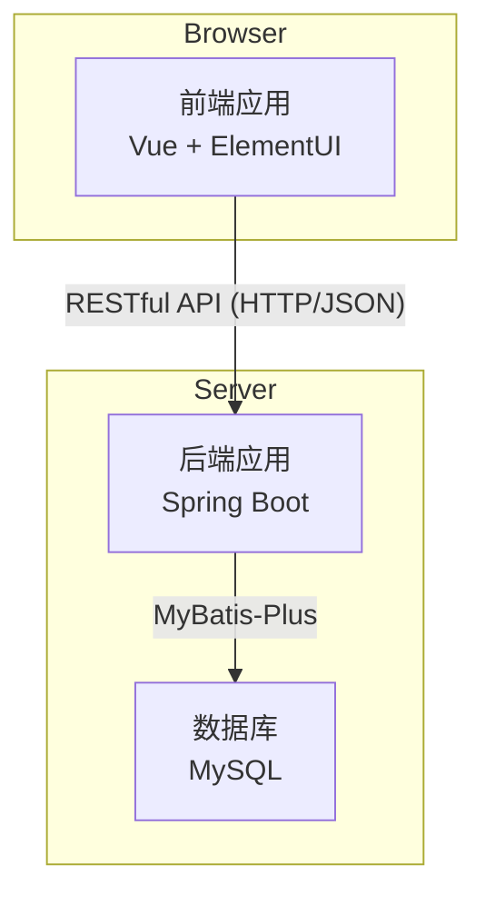
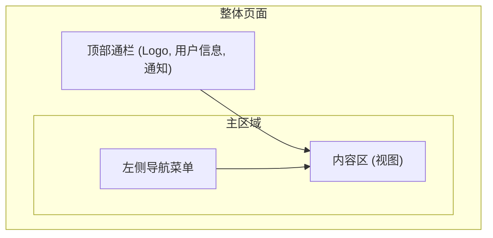

# 鄂北地区水资源项目开发文档

## 1. 引言

### 1.1. 文档目的

本开发文档旨在明确鄂北地区水资源项目的总体设计、技术架构、模块功能和 API 规范。它将作为项目开发团队（包括前端、后端工程师）进行系统设计、开发、测试和维护的核心指导文件，确保所有成员对项目有统一的理解，并协同高效地完成开发任务。

### 1.2. 项目概述

本项目旨在为鄂北地区水资源配置工程构建一个现代化的信息管理平台。平台融合云计算、物联网、大数据等新一代信息技术，围绕"一张图"、"实时监测"、"工程巡检"、"预警管理"等核心业务，实现对水厂、泵站、水库等水利设施的全面监控与智能化管理，提升水资源调配效率、安全保障能力和管理现代化水平。

### 1.3. 技术选型

- **后端**:
  - **核心框架**: Spring Boot 2.6.13
  - **Java 版本**: JDK 1.8
  - **数据持久层**: MyBatis + MyBatis-Plus (替代 Spring Data JPA)
  - **分页插件**: PageHelper 5.3.2
  - **数据库**: MySQL 8+ (mysql-connector-j)
  - **空间数据支持**: Hibernate Spatial 5.6.15.Final + JTS Topology Suite 1.19.0
  - **API 文档**: SpringDoc OpenAPI 1.6.14 (Swagger 3.0)
  - **开发工具**: Lombok (代码生成)
  - **构建工具**: Maven 3.8.1
- **前端**:
  - **核心框架**: Vue.js 3.5.17
  - **构建工具**: Vite 5.4.0
  - **UI 组件库**: Element Plus 2.10.2
  - **状态管理**: Pinia 3.0.3
  - **路由管理**: Vue Router 4.5.1
  - **图表库**: ECharts 5.4.3 + Vue-ECharts 6.6.1
  - **地图库**: Leaflet 1.9.4 + Vue-Leaflet 0.10.1
  - **HTTP 客户端**: Axios 1.10.0
  - **样式预处理**: Sass 1.89.2
- **架构**:
  - **模式**: 前后端分离的单体应用架构
  - **通信**: 基于 RESTful API，使用 JSON 格式进行数据交换

### 1.4. 术语说明

为确保项目各方理解一致，特此说明部分业务术语与技术实现中的对应关系：

| 业务术语 (源自需求文档) | 技术术语 (本文档及代码中) | 说明                                                                   |
| ----------------------- | ------------------------- | ---------------------------------------------------------------------- |
| 机构管理                | 部门管理 (Department)     | "部门"是更具体的技术实体，具有清晰的层级关系。                         |
| 人员信息管理            | 用户管理 (User)           | "用户"指可登录和操作本系统的账户实体，与"人员"概念基本对应。           |
| 岗位管理                | 岗位管理 (Position)       | 新增的独立模块，对用户的职务/岗位进行结构化管理。                      |
| 维护记录                | 问题跟踪 (Issue Tracking) | "维护"作为一种问题处理的跟进行为，被统一整合到更强大的问题跟踪模块中。 |

## 2. 系统架构设计

### 2.1. 架构概述

系统采用成熟的前后端分离架构。

- **前端应用 (Frontend)**：作为用户交互的入口，是一个独立的单页面应用 (SPA)。负责视图展示、用户交互和数据可视化。它通过调用后端提供的 RESTful API 来获取和提交数据。
- **后端应用 (Backend)**：作为业务逻辑和数据处理的核心，是一个单体 Spring Boot 应用。负责处理业务逻辑、数据持久化、提供安全的 RESTful API 接口，并与数据库进行交互。
- **数据库 (Database)**：使用 MySQL 数据库，存储所有业务数据，表结构设计详见 `DATABASE_SCHEMA.md`。



### 2.2. 前端架构

前端项目基于 Vue 3 + Vite 生态系统构建，采用 Composition API、模块化、组件化的现代开发思想。

- **目录结构**:
  - `src/api`: 统一管理所有对后端 API 的请求，使用 Axios 进行 HTTP 通信。
  - `src/assets`: 存放静态资源，如图片、字体、全局样式。
  - `src/components`: 存放可复用的全局 UI 组件，使用 Vue 3 Composition API。
  - `src/views`: 存放页面级组件，对应各个路由。
  - `src/router`: 使用 Vue Router 4 定义前端路由和权限守卫。
  - `src/stores`: 使用 Pinia 进行全局状态管理，替代 Vuex。
  - `src/utils`: 存放工具函数和通用逻辑。
- **UI 库**: Element Plus 提供高质量的 Vue 3 兼容基础组件，加速开发进程。
- **数据可视化**: 使用 ECharts 5 + Vue-ECharts 6 实现图表功能。对于地图"一张图"功能，使用 Leaflet + Vue-Leaflet 实现 GIS 功能。
- **构建工具**: Vite 提供快速的开发服务器和优化的生产构建。

### 2.3. 后端架构

后端应用遵循分层架构设计模式，确保代码的高内聚、低耦合。

- **Controller (控制层)**: 负责接收前端的 HTTP 请求，调用 Service 层处理业务，并向前端返回响应。使用 SpringDoc 注解自动生成 API 文档。
- **Service (业务层)**: 实现具体的业务逻辑。一个 Service 方法通常对应一个业务场景，可能调用多个 Mapper 完成操作。
- **Mapper (数据访问层)**: 使用 MyBatis-Plus 接口，继承 BaseMapper 获得基础 CRUD 功能，支持注解和 XML 两种方式定义 SQL。特别支持空间数据查询。
- **Entity (实体层)**: POJO 对象，与数据库表结构一一对应，使用 MyBatis-Plus 注解进行映射。支持自动填充、逻辑删除等功能。
- **DTO (数据传输对象)**: 用于在 Controller 层和 Service 层之间传输数据，避免直接暴露 Entity，实现视图与模型的解耦。

## 3. 系统模块设计 (按需求功能划分)

本系统根据需求说明书，主要划分为以下核心功能模块。

### 3.1. 一张图

#### 3.1.1. 水资源概况展示

通过 GIS 地图直观展示鄂北地区主要河流、湖泊和水库的基本信息，包括河段长度、流域面积、流经区域等。结合地图动态呈现各水体的位置、级别以及相关管理人员信息，为用户全面了解区域水资源分布提供可视化支持。

#### 3.1.2. 管理体系展示

清晰呈现各级水资源管理责任体系，涵盖县级、乡级和村级管理人员信息及其对应的管理区域。用户可查看各级管理人员的联系方式与职责范围，明确管护主体，助力高效开展水资源管护工作。

#### 3.1.3. 水利设施信息展示

汇总鄂北地区与水资源相关的各类水利工程设施，如水库、泵站、水闸等。通过地图标注，用户点击即可查看具体设施的详细信息，包括设施类型、运行状态、维护记录等，便于全面掌握区域水利设施情况。

#### 3.1.4. 水质监测信息展示

实时展示自动监测站点的水质数据，涵盖关键指标如 pH 值、溶解氧、氨氮等。用户可点击具体监测点，查看详细监测数据及历史趋势，及时掌握水质变化动态，为水资源保护提供数据支持。

#### 3.1.5. 问题清单管理

按时间顺序列出当前未解决的水资源相关问题，涵盖水污染、设施损坏等各类情况。点击问题可查看详细信息，包括问题描述、发生地点、上报人、处置进度等，便于管理者及时跟进处理。

#### 3.1.6. 履职统计

**本级履职统计**: 展示本级水资源管理人员的履职情况，包括巡查完成率、事件办结率等关键指标。支持按年份和时间范围筛选数据，用户还可查看本级管理人员与其他同层级人员的履职对比情况，包括巡查次数、解决问题数等排名。

**下级履职统计**: 展示下辖区域的履职情况，涵盖不同区域管理人员的履职数据。包括履职人数、巡查次数、发现问题及解决问题数等指标，以图形化方式呈现履职进度，便于上级管理者全面了解下级工作情况。

#### 3.1.7. 巡查及解决问题排名

分别展示本级及下辖区域管理人员的巡查次数和解决问题情况排名。通过巡查次数占比和解决问题占比等指标，直观呈现各级管理人员的工作绩效，激励提升工作效率，保障水资源管理工作的顺利开展。

### 3.2. 实时监测

#### 3.2.1. 监测体系展示

通过整合鄂北地区的水利基础数据，包括水厂、管理站、加压泵站、流量站等监测站点，实时监测模块全面展示了区域内的水利设施运行情况，形成了完整的实时监测网络体系。

#### 3.2.2. 监测信息管理

**实时监测数据**: 展示包括水位、水质、流量等实时监测数据的预警信息。预警类型涵盖水位超警、水质异常、流量突变等情况，确保及时发现潜在问题。

**重点监测数据信息**:

- **水位监测统计**: 展示各监测站点的实时水位数据，包括水位变化趋势图、最高水位站点统计等
- **水质监测信息**: 展示关键监测站点的水质指标，如 pH 值、溶解氧、氨氮等，以可视化形式呈现水质状况
- **流量监测信息**: 根据流量监测站点的上下游关系，展示流量变化曲线，直观呈现流量动态

#### 3.2.3. 数据分析与展示

**监测数据分析**: 以可视化的形式展示监测数据的分析结果。用户可以选择不同的监测站点，查看该站点的监测数据统计信息，包括历史数据对比、趋势分析等。

**监测结果详细查看**: 在可视化展示中，用户可以查看监测结果的关键数据，同时还可以点击详情，查看监测数据的详细信息，如具体数值、监测时间等。

#### 3.2.4. 动态模拟与展示

**监测数据演进**: 预演计算完成后，用户可以选择预演结果编号进行查看。地图上将会展示监测数据的变化过程，如水位、流量的变化趋势，并按照数据大小进行渲染展示，动态展示监测数据的变化过程。

**风险分析**: 在监测数据分析的基础上，用户可以查看受影响的水利工程设施，以及受影响的区域范围、面积等信息。

**工况信息展示**: 用户可以查看重点监测站点的运行工况信息，包括设备运行状态、监测数据的最值、是否超警等。

#### 3.2.5. 决策支持

**监测方案展示**: 根据监测数据的分析结果，生成相应的监测方案，包括监测频率调整、监测设备优化等，为用户查看整个研究区域内的监测方案提供支持。

**应急响应方案**: 结合监测数据和风险分析结果，提供应急响应方案，如设备维护建议、人员调度信息等。

**资源信息展示**: 包含监测设备库、维护队伍、物资仓库等信息，用户可以在地图上查看资源的空间位置与具体信息。

**监测信息可视化**: 包含监测站点分布、监测数据变化趋势等信息，用户可以在可视化地图上查看各类监测信息的分布图，为监测决策提供支持。

### 3.3. 工程巡检

#### 3.3.1. 巡检任务异常处理

通过巡检任务异常处理功能，系统支持自定义巡检计划，明确巡检频次、巡检内容和责任人，确保巡检工作的规范化和常态化。巡检人员可以通过移动端上传巡检任务，实时记录巡检过程中的设备运行状态、发现的问题等信息，实现巡检工作的全程跟踪和管理。

#### 3.3.2. 巡检数据采集

巡检人员在巡检过程中，如果发现设备存在问题，可以使用移动端设备进行拍照，并上传文字描述到网页端。系统支持多种数据采集方式，包括图片、文字等，方便巡检人员全面记录设备状况。采集到的数据将实时上传至平台，形成完整的巡检记录，便于后续的查询和分析。

### 3.4. 预警管理

#### 3.4.1. 预警信息管理

**预警信息展示**: 通过预警信息展示功能，集中呈现当前所有活跃的预警信息。系统支持按类型（如水位预警、水质预警、流量预警等）、和时间顺序对预警信息进行分类展示。预警信息以醒目的图标和颜色标记在地图上，方便用户快速定位问题区域。点击具体预警点，可查看详细的预警信息，包括预警类型、预警时间、预警级别、具体数值、触发条件等。

**预警信息处理**: 预警信息模块提供多种处理功能，帮助用户高效管理预警信息。当问题得到解决或风险解除后，用户可以通过系统手动解除预警状态。解除操作会记录解除时间、解除原因等信息，便于后续追溯。对于误报或已过期的预警信息，用户可以进行删除操作，以保持系统的清洁和高效运行。删除操作同样会记录详细信息，确保操作的可追溯性。

#### 3.4.2. 预警指标设定

**预警指标设定**: 通过预警指标设定功能，用户可以对水位、水质、流量等关键指标的预警阈值进行详细设定。系统支持为每个指标分别设置上上限、上限、下限、下下限等四个阈值，以满足不同场景下的预警需求。用户可以根据实际运行情况和管理要求，灵活调整各指标的预警阈值，确保预警系统能够准确反映潜在风险。

**预警指标管理**: 预警指标设定模块提供多种管理功能，帮助用户高效维护预警指标。用户可以随时对已设定的预警阈值进行修改，以适应运行条件的变化或管理要求的更新。修改操作会记录修改时间、修改人等信息，便于后续追溯。对于不再需要的预警阈值，用户可以进行删除操作，以保持系统的清洁和高效运行。用户可以随时查看当前所有预警指标的阈值设置情况，包括各指标的上上限、上限、下限、下下限等具体数值，以及对应的预警级别和描述信息。

#### 3.4.3. 搜索功能设计（2025 年 1 月更新）

**设计原则**: 根据需求规范要求，预警管理模块的搜索功能采用简化设计，只实现按名称的下拉选择搜索，避免复杂的多字段搜索。

**预警信息管理搜索**:

- **搜索字段**: 仅支持按"预警地点"进行搜索
- **搜索方式**: 下拉选择框，选项从现有预警记录中动态获取
- **实现逻辑**:
  - 系统自动从已有预警记录中提取不重复的预警地点列表
  - 用户通过下拉选择框选择特定预警地点进行筛选
  - 支持清空选择以显示全部记录

**预警指标设定搜索**:

- **搜索字段**: 仅支持按"测点名称"进行搜索
- **搜索方式**: 下拉选择框，选项从现有预警指标中动态获取
- **实现逻辑**:
  - 系统自动从已有预警指标中提取不重复的测点名称列表
  - 用户通过下拉选择框选择特定测点名称进行筛选
  - 支持清空选择以显示全部记录

**技术实现**:

- **前端组件**: 使用 `CommonSearch` 通用搜索组件
- **搜索字段配置**: 简化为单个 `select` 类型字段
- **数据获取**: 通过现有 API 获取数据后提取选项列表
- **后端接口**: 复用现有分页查询接口，支持单字段筛选

**修改记录**:

- **修改时间**: 2025 年 1 月 28 日
- **修改原因**: 原实现包含多个搜索字段（预警地点、预警类型、预警等级、预警状态、所属工程、时间范围等），不符合需求规范中"只实现按名称的下拉选择搜索"的要求
- **修改内容**:
  - 简化预警信息管理搜索为仅支持预警地点选择
  - 简化预警指标设定搜索为仅支持测点名称选择
  - 移除其他复杂搜索字段和时间范围搜索
  - 保持后端接口兼容性，无需修改 API

### 3.5. 管理信息服务

#### 3.5.1. 模块定位

管理信息服务专注于工程运行管理中的基础信息档案管理，严格按照需求说明书 4.5 节实现，与系统管理模块明确分工。

**职责边界**：

- **管理信息服务**：业务层面的信息档案管理，关注工作职责和业务分工
- **系统管理**：技术层面的权限分配和系统配置，关注登录权限和功能控制

**权限要求**：

- 管理信息服务模块的所有功能使用 `business:manage` 权限控制
- 业务管理员岗位拥有此权限，可以完整访问管理信息服务功能

#### 3.5.2. 部门信息管理

- **基本信息维护**：部门名称、职责范围、联系方式
- **层级关系管理**：部门上下级关系维护
- **基础操作**：支持增加、删除、修改、查询操作
- **业务特色**：专注于工程运行管理中的部门职责记录
- **API 接口**：`/api/management-info/departments/*`

#### 3.5.3. 人员信息管理

- **基本档案管理**：姓名、职务、联系方式、工作职责
- **归属关系**：人员与部门的归属关系维护
- **基础操作**：支持增加、删除、修改、查询操作
- **业务特色**：专注于工程运行管理中的人员档案记录
- **API 接口**：`/api/management-info/personnel/*`
- **与系统管理区别**：不涉及登录权限和系统配置，专注业务档案

### 3.6. 系统管理

#### 3.6.1. 模块定位

系统管理专注于技术层面的权限分配、系统配置和基础数据管理，为整个系统提供技术支撑。

#### 3.6.2. 系统管理模块（8 个平级模块）

根据需求说明书要求，系统管理模块包含以下 8 个管理入口：

- **行政区划管理**：省市县乡村五级区划、地理编码维护
- **组织机构管理**：机构层级结构、组织架构管理
- **部门管理**：技术层面的组织架构、权限分配依据
- **岗位管理**：技术层面的职位体系、权限控制基础
- **角色管理**：权限级别定义、角色权限配置
- **用户管理**：系统登录账号、密码、账号状态管理
- **字典管理**：枚举值、配置参数、下拉选项管理（✅ 已实现）
- **资源管理**：文档、图片、视频等资源文件管理

**权限要求**：

- 系统管理模块的所有功能使用 `system:manage` 权限控制
- 只有系统管理员岗位拥有此权限

#### 3.6.3. 权限设计机制

系统采用标准的基于角色的访问控制（Role-Based Access Control, RBAC）模型：

**核心概念**：

- **用户（User）**：系统登录账号，用于访问和操作系统
- **人员（Personnel）**：现实中的工作人员，是被管理的业务对象
- **岗位（Position）**：职务职责，分配给人员，纯业务概念
- **角色（Role）**：权限的集合，分配给用户，控制系统访问权限
- **权限（Permission）**：具体的操作权限，如查看、编辑、删除等

**权限获取链路**：

```
用户 → 角色 → 权限
```

**业务管理链路**：

```
人员 → 岗位 → 部门
```

**权限控制流程**：

1. 用户登录系统
2. 系统根据用户的角色获取权限列表
3. 前端根据权限控制页面元素的显示和隐藏
4. 后端在接口层面进行权限验证

**用户与人员关联**：

- 用户可以关联人员（可选）
- 人员可以拥有系统账号（可选）
- 用户管理人员信息

**设计优势**：

- 概念清晰：用户管系统，人员管业务
- 权限控制简洁：标准 RBAC 模型
- 职责分离：权限与业务管理解耦
- 灵活性强：人员可以没有系统账号

#### 3.6.4. 与管理信息服务的区别

| 对比项目       | 系统管理                               | 管理信息服务                                       |
| -------------- | -------------------------------------- | -------------------------------------------------- |
| **权限要求**   | system:manage                          | business:manage                                    |
| **用户范围**   | 系统管理员                             | 业务管理员                                         |
| **部门管理**   | 技术层面组织架构                       | 业务层面部门职责                                   |
| **用户管理**   | 系统登录账号管理                       | -                                                  |
| **人员管理**   | -                                      | 业务人员档案管理（显示所有工程运行管理涉及的人员） |
| **岗位管理**   | 岗位定义和维护（纯业务概念）           | -                                                  |
| **数据关注点** | 权限、登录、系统配置                   | 工作职责、业务分工                                 |
| **API 路径**   | /api/users, /api/positions, /api/roles | /api/management-info/personnel                     |

**行政区划管理（简化版）**：

- **功能定位**：维护系统中涉及的行政区域基础数据，为其他模块提供区域筛选支持
- **核心功能**：
  - 省市县乡村五级区划基础维护
  - 区域编码标准化管理（遵循 GB/T2260-2007 标准）
  - 区域层级关系维护
- **使用场景**：
  - "一张图"模块按区域展示水资源分布
  - 预警管理按区域筛选和查询
  - 设施管理按区域分类统计
  - 为其他业务模块提供区域维度支持
- **简化说明**：
  - 不涉及复杂的地理信息处理
  - 不包含地图绘制和空间分析功能
  - 专注于基础的区域数据维护和查询支持

**字典管理（已实现）**：

- **功能定位**：统一管理系统中的各种枚举值、配置参数和下拉选项，为整个系统提供标准化的数据字典服务
- **核心功能**：
  - **字典类型管理**：管理字典分类，如"用户状态"、"设备状态"、"预警级别"等
  - **字典数据管理**：管理具体的字典项，如"启用/禁用"、"正常/故障/维护"等
  - **层级关系支持**：支持字典类型与字典数据的关联管理
  - **状态管理**：支持字典的启用/禁用状态控制
  - **排序功能**：支持自定义排序，便于界面展示和程序调用
- **预设字典类型**：
  - `user_status`：用户状态（启用、禁用）
  - `yes_no`：是否选择（是、否）
  - `device_status`：设备状态（正常、故障、维护）
  - `warning_level`：预警级别（一级、二级、三级、四级）
  - `personnel_status`：人员状态（在职、离职、休假）
  - `department_status`：部门状态（启用、禁用）
  - `data_source`：数据来源（手动录入、自动采集、第三方接口）
- **使用场景**：
  - 用户管理模块的状态下拉选择（✅ 已集成）
  - 设备管理模块的状态筛选和展示（待集成）
  - 预警管理模块的级别分类（✅ 已集成）
  - 表单组件的下拉选项数据源（✅ 已集成）
  - 数据展示时的状态标签转换（✅ 已集成）
- **技术实现**：
  - **数据表**：`dict_types`（字典类型表）、`dict_data`（字典数据表）
  - **API 接口**：18 个 RESTful 接口，支持完整的 CRUD 操作
  - **前端工具**：`useDictionary` 组合式函数，提供字典数据获取、缓存和转换功能
  - **通用组件**：`DictSelect` 组件，基于字典类型编码自动加载选项
  - **权限控制**：需要`system:manage`权限
  - **数据校验**：类型编码唯一性、同类型下键值唯一性
  - **关联处理**：删除字典类型时自动删除关联的字典数据
  - **缓存机制**：5 分钟缓存，提升性能并减少 API 调用
- **集成状态**：
  - ✅ 用户管理模块：状态筛选和显示已使用字典数据
  - ✅ 预警管理模块：预警级别筛选和显示已使用字典数据
  - ✅ 通用组件：DictSelect 组件可在任意模块中使用
  - ✅ 工具函数：useDictionary 提供统一的字典数据访问接口
- **API 路径**：
  - 字典类型：`/api/system/dict/types/*`
  - 字典数据：`/api/system/dict/data/*`

#### 3.6.4. 系统维护工具

- **字典管理**：系统枚举值、配置参数管理
- **资源管理**：系统资源文件、版本控制

### 3.7. 工程信息服务

#### 3.7.1. 模块架构设计

工程信息服务模块采用标准的分层架构设计，实现了水利工程设施信息的精细化管理。

**技术架构**：

- **实体层（Entity）**：8 个设施实体类，对应数据库表结构
- **DTO 层（Data Transfer Object）**：32 个数据传输对象，包含创建、更新、响应、查询四类 DTO
- **数据访问层（Mapper）**：8 个 Mapper 接口，基于 MyBatis-Plus 实现
- **业务逻辑层（Service）**：8 个业务服务类，处理核心业务逻辑
- **控制层（Controller）**：8 个 REST 控制器，提供 API 接口

**核心特性**：

- **统一的 CRUD 操作模式**：所有设施类型都支持标准的增删改查操作
- **完整的权限控制**：所有接口都需要`business:manage`权限
- **软删除支持**：删除操作采用逻辑删除，保留历史数据
- **关联查询优化**：支持部门、人员等关联信息的联合查询
- **分页查询支持**：大数据量场景下的高效分页处理
- **数据验证机制**：完善的输入验证和业务规则校验

**接口总览**：
共 57 个 REST API 接口，覆盖 8 个设施类型的完整管理功能：

- 泵站管理：7 个接口
- 水厂管理：7 个接口
- 水库管理：7 个接口
- 监测站点管理：7 个接口
- 管道信息管理：7 个接口
- 村庄信息管理：7 个接口
- 浮船信息管理：7 个接口
- 消毒药材管理：8 个接口（包含库存统计功能）

#### 3.7.2. 核心设施管理

##### 3.7.2.1. 泵站信息管理

泵站模块专注于泵站设施及其设备的信息管理，提供全面的增删改查功能，确保泵站运行信息的准确性和完整性。

**API 接口路径**：`/api/engineering-service/pumping-stations`

**核心功能**：

- **增加泵站信息**：新增泵站基础信息，包括泵站名称、地理位置、设计流量、扬程、水泵数量及型号、电机功率、控制系统等详细信息
- **删除泵站信息**：软删除操作，记录删除时间和操作人信息，保持数据可追溯性
- **修改泵站信息**：支持泵站信息的实时更新，记录修改历史，确保操作的可追溯性
- **查询泵站信息**：支持多条件筛选查询，包括泵站名称、设备类型、运行状态、管理部门等

**数据结构**：

- 基础信息：泵站编码、名称、类型、位置坐标
- 技术参数：设计流量、扬程、装机功率、水泵台数
- 管理信息：管理部门、负责人、运行方式、建设年份
- 状态信息：运行状态、维护状态、最后检修时间

##### 3.7.2.2. 水厂信息管理

水厂模块专注于水厂设施及其设备的信息管理，提供全面的增删改查功能，确保水厂运行信息的准确性和完整性。

**API 接口路径**：`/api/engineering-service/water-plants`

**核心功能**：

- **增加水厂信息**：新增水厂基础信息，包括水厂名称、位置、设计处理能力、实际处理量、主要工艺流程、关键设备配置等
- **删除水厂信息**：软删除操作，保持系统数据的清洁性和历史可追溯性
- **修改水厂信息**：支持水厂运行参数的动态调整和设备信息更新
- **查询水厂信息**：支持按水厂名称、处理工艺、运行状态等条件进行筛选查询

**数据结构**：

- 基础信息：水厂编码、名称、类型、地理位置
- 处理能力：设计处理能力、实际处理量、供水人口
- 工艺信息：处理工艺、主要设备、出水标准
- 管理信息：管理部门、负责人、建设年份、投运时间

##### 3.7.2.3. 水库信息管理

水库模块专注于水库设施及其设备的信息管理，提供全面的增删改查功能，确保水库运行信息的准确性和完整性。

**API 接口路径**：`/api/engineering-service/reservoirs`

**核心功能**：

- **增加水库信息**：新增水库基础信息，包括水库名称、库容、集水面积、坝型、坝高、各类水位等关键参数
- **删除水库信息**：软删除操作，确保重要水利设施信息的历史完整性
- **修改水库信息**：支持水库运行参数和设施状态的实时更新
- **查询水库信息**：支持按水库名称、库容等级、管理部门等条件进行查询

**数据结构**：

- 基础信息：水库编码、名称、类型、地理位置
- 技术参数：总库容、有效库容、集水面积、坝高、坝长
- 水位信息：正常蓄水位、死水位、防洪限制水位、设计洪水位
- 管理信息：管理部门、负责人、建设年份、工程等级

#### 3.7.3. 扩展设施管理

##### 3.7.3.1. 监测站点管理

**API 接口路径**：`/api/engineering-service/monitoring-stations`

监测站点模块管理各类水质、水位、流量监测设备和站点信息，支持监测网络的统一管理。

**核心功能**：监测点位信息管理、设备配置管理、监测数据关联、站点状态跟踪

##### 3.7.3.2. 管道信息管理

**API 接口路径**：`/api/engineering-service/pipelines`

管道模块管理输水管道、配水管网等管道设施信息，支持管网系统的全面管理。

**核心功能**：管道线路管理、管径材质信息、铺设年份记录、维护状态跟踪

##### 3.7.3.3. 村庄基础信息管理

**API 接口路径**：`/api/engineering-service/villages`

村庄模块管理供水服务覆盖的村庄基础信息，专注于地理位置和人口数据管理。

**核心功能**：村庄基础信息、地理位置定位、人口统计、备注信息管理

**优化说明**：

- 精简数据模型，移除了 9 个冗余字段
- 专注于村庄核心信息：名称、位置、人口、备注
- 提升查询性能和存储效率
- 简化业务逻辑，降低维护复杂度

##### 3.7.3.4. 浮船信息管理

**API 接口路径**：`/api/engineering-service/floating-boats`

浮船模块管理取水用浮船设备信息，支持移动取水设施的管理。

**核心功能**：浮船基础信息、技术参数管理、停靠位置记录、运行状态跟踪

##### 3.7.3.5. 消毒药材管理

**API 接口路径**：`/api/engineering-service/disinfection-materials`

消毒药材模块管理水处理过程中使用的各类消毒药材库存和使用信息。

**核心功能**：药材库存管理、使用记录跟踪、采购计划管理、安全库存预警

#### 3.7.4. 技术实现特点

**数据持久化**：

- 基于 MyBatis-Plus 实现，使用注解方式配置映射关系
- 支持自动填充创建时间、更新时间等审计字段
- 实现软删除机制，保证数据的历史完整性

**业务逻辑处理**：

- 统一的异常处理机制，确保系统稳定性
- 完善的数据验证规则，保证数据质量
- 支持事务管理，确保数据一致性

**接口设计规范**：

- 遵循 RESTful 设计原则，接口语义清晰
- 统一的响应格式，便于前端处理
- 完整的 Swagger 文档，支持接口自动化测试

**权限控制机制**：

- 所有接口都需要`business:manage`权限
- 支持细粒度的操作权限控制
- 完整的操作日志记录

### 3.8. 移动应用端（APP）

#### 3.8.1. 巡检上报

巡检上报模块是 APP 的核心功能之一，主要用于现场巡检人员记录和上报巡检过程中发现的问题或情况。

**现场数据采集**: 巡检人员在水厂、泵站、水库、明渠等设施现场进行巡检时，可以使用手机拍照、录像，记录设备运行状态、故障情况或其他重要信息。支持多种格式的图片和视频文件，确保现场情况的完整记录。

**文字描述记录**: 巡检人员可以通过文字描述详细说明问题的具体情况，包括问题类型、严重程度、影响范围、建议处理措施等关键信息，为后续处理提供详细的参考依据。

**地理位置记录**: 系统自动记录巡检上报时的地理位置信息，确保问题定位的准确性，便于相关人员快速到达现场进行处理。

**实时数据同步**: 采集到的数据和描述信息可以通过网络实时上传至平台服务器，确保管理人员能够第一时间获取现场情况，及时安排维修或采取相应措施。

**离线数据缓存**: 在网络信号不佳的现场环境中，系统支持离线模式，将巡检数据暂存在本地，待网络恢复后自动或手动同步到服务器，确保数据不丢失。

#### 3.8.2. 巡检统计

巡检统计模块为管理人员提供了一个全面了解巡检工作执行情况的窗口，帮助其更好地评估巡检效果和优化巡检计划。

**任务完成情况统计**: 系统自动统计每个巡检人员或团队的任务完成情况，包括已巡检的设施数量、未完成任务数量等，以直观的图表形式展示，便于管理人员快速了解整体进度。

**个人巡检记录**: 巡检员可以查看个人的巡检历史记录，包括巡检时间、巡检地点、发现问题、处理状态等详细信息，便于个人工作总结和经验积累。

**团队绩效分析**: 管理人员可以查看团队整体的巡检绩效，包括巡检覆盖率、问题发现率、问题解决率等关键指标，为团队管理和绩效考核提供数据支持。

**趋势分析报告**: 系统提供巡检工作的趋势分析，包括月度、季度巡检完成情况对比，问题类型分布统计等，帮助管理者识别工作规律和改进方向。

#### 3.8.3. 个人中心

个人中心模块为用户提供个性化的操作界面和管理功能，方便用户进行自我管理和信息查询。

**个人信息管理**: 用户可以查看和修改个人基本信息，包括姓名、联系方式、所属部门、岗位职责等，确保个人信息的准确性和时效性。

**密码安全管理**: 提供密码修改功能，用户可以定期更换登录密码，增强账户安全性。支持密码强度检测，确保密码符合安全要求。

**应用设置配置**: 用户可以根据个人使用习惯配置 APP 设置，包括消息推送设置、数据同步频率、界面显示偏好等，提升使用体验。

**工作统计查看**: 用户可以查看个人的工作统计信息，包括本月巡检次数、发现问题数量、处理完成情况等，便于个人工作总结和自我评估。

**通知消息管理**: 集中管理系统推送的各类通知消息，包括新任务分配、预警信息、系统公告等，确保重要信息不遗漏。

**离线数据管理**: 查看和管理本地缓存的离线数据，包括待同步的巡检记录、下载的参考资料等，确保数据的完整性和一致性。

## 4. API 设计规范

为保证前后端协作效率和系统可维护性，API 设计遵循以下规范：

- **4.1. 风格**: 遵循 RESTful API 设计风格。
- **4.2. 协议**: 使用 HTTPS 协议。
- **4.3. URL**:
  - API 根路径统一为 `/api`。
  - 采用版本号，如 `/api/v1`。
  - 资源名称使用名词复数，如 `/api/v1/users`。
- **4.4. HTTP 方法**:
  - `GET`: 查询资源。
  - `POST`: 新建资源。
  - `PUT`: 更新整个资源。
  - `PATCH`: 更新部分资源（可选）。
  - `DELETE`: 删除资源。
- **4.5. 数据格式**: 请求体和响应体统一使用 `application/json` 格式。响应体采用统一结构，包含状态码、消息和数据负载，例如：
  ```json
  {
    "code": 200,
    "message": "Success",
    "data": { ... }
  }
  ```
- **4.6. 状态码**: 遵循标准 HTTP 状态码语义，如 `200 OK`, `201 Created`, `400 Bad Request`, `401 Unauthorized`, `404 Not Found`, `500 Internal Server Error`。
- **4.7. API 文档**: 后端将使用 Swagger (SpringFox/SpringDoc) 自动生成交互式 API 文档，方便前端查阅和调试。

## 5. 前端 UI 设计规范

### 5.1. 设计原则与目标

为确保平台在内部使用场景下的高效性与实用性，前端 UI 设计遵循以下核心原则：

- **简洁高效**: 界面元素清晰，交互路径直接，避免不必要的装饰和动画，让用户能够快速完成任务。
- **内容突出**: 布局和视觉设计应优先服务于数据和功能，最大化内容展示空间，确保关键信息一目了然。
- **体验一致**: 在整个应用中保持统一的布局、色彩、字体和组件风格，降低用户的学习成本。

### 5.2. 整体布局

系统采用**经典专业型**的"顶部通栏 + 左侧导航菜单"后台管理布局。此布局成熟稳定，结构清晰，将视觉焦点最大限度地让位于内容本身，是实现简洁高效界面的最佳实践。

- **顶部通栏 (Header)**: 固定在页面顶部，高度为 `60px`。从左至右依次为：系统 Logo 与名称、面包屑导航（可选）、全局功能区（如搜索、帮助、通知）、用户信息及操作（头像、用户名、退出登录）。
- **左侧导航 (Sidebar)**: 显示系统的主要功能模块，支持多级菜单和折叠功能，为内容区提供最大的展示空间。
- **内容区 (Main Content)**: 页面的核心区域，用于展示各个功能模块的具体视图。



### 5.3. 色彩方案

色彩方案以蓝色为主题色，符合水利行业的专业形象，整体色调明亮、清晰。

| 角色             | HEX (十六进制) | 用途说明                               |
| ---------------- | -------------- | -------------------------------------- |
| 主题色 (Primary) | `#409EFF`      | 用于关键操作按钮、导航选中状态、链接等 |
| 成功色 (Success) | `#67C23A`      | 用于表示操作成功、状态正常的提示       |
| 警告色 (Warning) | `#E6A23C`      | 用于表示需要注意的、非紧急的提示       |
| 危险色 (Danger)  | `#F56C6C`      | 用于表示危险操作、错误、高风险预警     |
| 主文字色         | `#303133`      | 用于正文、标题等大部分文字内容         |
| 基础背景色       | `#F5F7FA`      | 用于页面整体背景                       |
| 卡片/表格背景色  | `#FFFFFF`      | 用于卡片、表格、弹窗等内容承载区       |

### 5.4. 字体规范

- **基础字体**: "Helvetica Neue", Helvetica, "PingFang SC", "Hiragino Sans GB", "Microsoft YaHei", "微软雅黑", Arial, sans-serif
- **主字号**: `14px`
- **行高**: `1.5`

### 5.5. 组件风格

所有组件原则上直接使用 **Element UI** 的默认风格，不做过度定制，以保证视觉统一和开发效率。

- **卡片 (`el-card`)**: 用于模块化展示信息，卡片之间应保持 `20px` 的间距。
- **表格 (`CommonTable`)**: 使用自定义表格组件，表格内容应左对齐，表头文字加粗居中。操作列固定在右侧。支持排序、溢出提示、右键菜单等功能。
- **按钮 (`CustomButton`)**: 使用自定义按钮组件，主要操作使用 `primary` 类型，次要操作使用 `secondary` 类型，危险操作使用 `danger` 类型并需二次确认。

### 5.6. 自定义按钮组件使用规范

项目已完全迁移到自定义按钮组件 `CustomButton`，不再使用 Element UI 的 `el-button` 组件。

**CustomButton 组件特性**：

- **按钮类型**: `primary`（主要）、`secondary`（次要）、`danger`（危险）、`text`（文本）
- **按钮尺寸**: `large`、`default`、`small`
- **状态支持**: `loading`（加载中）、`disabled`（禁用）
- **图标支持**: 使用 Font Awesome 4.7.0 图标

**标准用法**：

```vue
<!-- 基础按钮 -->
<CustomButton type="primary" @click="handleSubmit">提交</CustomButton>
<CustomButton type="secondary" @click="handleCancel">取消</CustomButton>
<CustomButton type="danger" @click="handleDelete">删除</CustomButton>

<!-- 带图标的按钮 -->
<CustomButton type="primary" @click="handleAdd">
  <i class="fa fa-plus"></i>
  新增
</CustomButton>

<!-- 加载状态按钮 -->
<CustomButton type="primary" :loading="submitting" @click="handleSubmit">
  {{ submitting ? '提交中...' : '提交' }}
</CustomButton>

<!-- 不同尺寸按钮 -->
<CustomButton type="primary" size="large">大按钮</CustomButton>
<CustomButton type="primary" size="default">默认按钮</CustomButton>
<CustomButton type="primary" size="small">小按钮</CustomButton>
```

### 5.7. 表格组件使用规范

项目已完全迁移到自定义表格组件 `CommonTable`，不再使用 Element UI 的 `el-table` 组件。

**标准用法**：

```vue
<CommonTable
	:data="dataList"
	:columns="tableColumns"
	:loading="loading"
	:show-selection="true"
	:show-actions="true"
	@selection-change="handleSelectionChange"
>
  <template #actions="{ row }">
    <div class="action-buttons">
      <CustomButton type="primary" size="small" @click="handleEdit(row)">编辑</CustomButton>
      <CustomButton type="danger" size="small" @click="handleDelete(row)">删除</CustomButton>
    </div>
  </template>
</CommonTable>
```

**列配置规范**：

```javascript
const tableColumns = [
	{ prop: "name", label: "名称", minWidth: 120, sortable: true },
	{ prop: "status", label: "状态", width: 80, align: "center" },
	{ prop: "remark", label: "备注", minWidth: 150, showOverflowTooltip: true },
];
```

### 5.6. 关键页面线框设计 (文本描述)

#### 1. 首页/概览页

作为用户登录后可选的概览页面，用于展示系统的核心状态摘要。布局应保持简洁，避免信息过载。

- **顶部卡片区**: 以简洁的卡片形式，展示 2-4 个最关键的指标，如"当前预警总数"和"待办任务数"。
- **内容列表区**:
  - **待办事项**: 使用简洁列表，显示分配给当前用户的最紧急的几项任务。
  - **最新动态**: 显示最新的几条系统公告或重要通知。

#### 2. 标准数据管理页 (CRUD)

适用于"信息服务"、"系统管理"等模块下的所有列表页面，布局统一。

- **搜索与操作区**: 页面顶部，左侧为基于 `el-form`

## 9. 修改记录

### 9.1. 预警记录时间选择器优化 (2025-01-19)

**修改目的**: 优化预警记录新增功能，防止发生时间超过当前时间，提升数据准确性和用户体验。

**修改内容**:

1. **前端文件修改**:

   - **文件**: `frontend/src/views/warning/components/RecordDialog.vue`
   - **修改内容**:
     - 添加 `disabledDate` 方法，禁止选择未来日期
     - 添加 `initializeDefaultTime` 方法，新增时默认显示当前时间
     - 在日期时间选择器中应用 `:disabled-date="disabledDate"` 属性
     - 在对话框打开时自动初始化默认时间

2. **功能改进**:

   - **时间限制**: 在日期选择器中直接禁止选择今天之后的日期
   - **默认时间**: 新增预警记录时，发生时间字段默认显示当前时间
   - **用户体验**: 避免用户手动选择当前时间，减少操作步骤

3. **技术实现**:
   - 使用 Element Plus 的 `el-date-picker` 组件的 `disabled-date` 属性
   - 通过 `Date.now()` 和 `time.getTime()` 比较实现日期限制
   - 使用 `toISOString().slice(0, 19)` 格式化默认时间

### 9.2. 预警指标设定搜索功能优化 (2025-01-28)

**修改目的**: 根据需求规范，简化预警指标设定的搜索功能，只保留测点名称和监测项的下拉选择搜索。

**修改内容**:

1. **前端文件修改**:

   - `frontend/src/views/warning/thresholds/index.vue`:

     - 添加监测项选项列表 `monitoringItemOptions`
     - 更新 `enhancedSearchFields` 配置，添加监测项下拉选择
     - 添加 `fetchMonitoringItemOptions` 方法获取监测项字典数据
     - 移除未使用的导入和变量

   - `frontend/src/views/warning/thresholds/hooks/useThresholds.js`:
     - 在 `searchForm` 中添加 `monitoringItem` 字段
     - 更新 `searchFields` 配置，移除 `isActive` 搜索，保留测点名称和监测项
     - 更新 `handleResetSearch` 方法，重置监测项字段

2. **功能变更**:

   - **移除的搜索功能**: 关键词搜索(keyword)、启用状态搜索(isActive)
   - **保留的搜索功能**: 测点名称下拉选择、监测项下拉选择
   - **后端 API**: 无需修改，保持向后兼容性

3. **实现效果**:
   - 搜索区域只显示两个下拉选择框：测点名称和监测项
   - 测点名称选项从现有数据中动态提取
   - 监测项选项从字典表 `monitoring_item` 中获取
   - 搜索和重置功能正常工作

**技术细节**:

- 使用 `useDictionary` 组合式函数获取监测项字典数据
- 保持后端 API 接口不变，前端只传递需要的参数
- 确保代码的可维护性和扩展性
